<div align="center">

#  Hey there! I'm Mohamed Alaa

### 🚀 **Java Developer** | **Python Programmer** | **.NET Specialist**


</div>

---

## 🎯 **About Me**

<div align="center">

```java
public class MohamedSapera {
    private String passion = "Full-Stack Development";
    private String[] languages = {"Java", "Python", ".NET"};
    private String currentFocus = "JavaFX, Python Automation & .NET Applications";
    private boolean alwaysLearning = true;
    
    public void code() {
        while (true) {
            drinkCoffee();
            writeCode();
            debug();
            celebrate();
        }
    }
}
```

</div>

- 🎓 **Computer Science Student** passionate about software engineering
- ☕ **Coffee-powered developer** who converts caffeine into clean code
- 🚀 **Currently building** Java applications with JavaFX and Python automation
- 🌱 **Always learning** new technologies and design patterns
- 💡 **Love solving complex problems** with elegant solutions

---

## 🛠️ **Tech Arsenal**

<div align="center">

### **Languages & Frameworks**


### **Tools & Technologies**


### **Databases & Testing**


</div>

---

## 📊 **GitHub Analytics**

<div align="center">


</div>

---

## 🏆 **Featured Projects**

<div align="center">

### 🍽️ **University Cafeteria Management System**


**A comprehensive cafeteria management system featuring:**
- 🎨 **Modern JavaFX GUI** with intuitive user interface
- 💎 **Loyalty Points System** with transaction history
- 📱 **Real-time Order Tracking** with status updates
- 🏗️ **Advanced OOP Design** following SOLID principles
- 🧪 **Comprehensive Testing** with JUnit & Mockito

[](https://github.com/saperaa/University-Cafeteria-System)
[](https://github.com/saperaa/University-Cafeteria-System)

</div>

---

## 🎮 **What I'm Working On**

```mermaid
graph LR
    A[☕ Coffee] --> B[💻 Coding]
    B --> C[🐛 Debugging]
    C --> D[🎉 Success]
    D --> A
    
    style A fill:#FF6B6B
    style B fill:#4ECDC4
    style C fill:#45B7D1
    style D fill:#96CEB4
```

<div align="center">



</div>

- 🔭 **Currently**: Building Java applications with JavaFX and Python automation scripts
- 🌱 **Learning**: Advanced .NET development and cloud deployment
- 👯 **Looking to collaborate**: Open source projects and hackathons
- 💬 **Ask me about**: Java, Python, .NET, OOP design patterns, software architecture
- ⚡ **Fun fact**: I can debug code while drinking coffee ☕

---

## 📈 **Contribution Activity**

<div align="center">


</div>

---

## 🤝 **Let's Connect!**

<div align="center">

[](https://www.linkedin.com/in/mohamedsapera/)
[](mailto:mohamedalaa0911@gmail.com)

</div>

---

<div align="center">

### 💡 **Favorite Quote**

> *"Code is like humor. When you have to explain it, it's bad."*  
> **~ Cory House**


</div>
